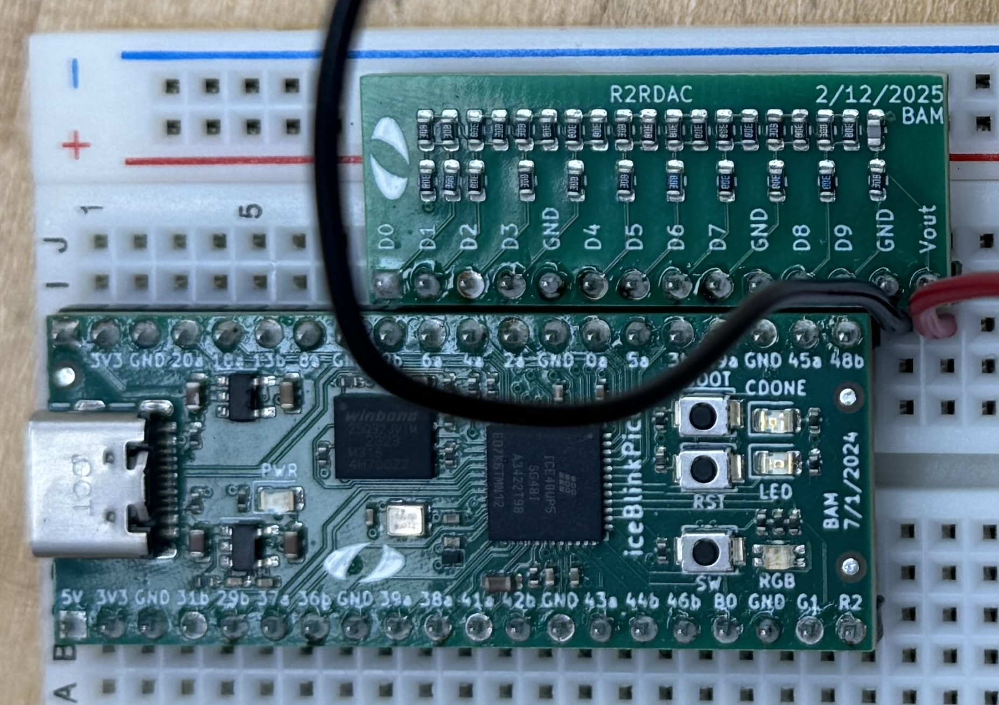

# Miniproject 3

Author: Enricco Gemha

Date: Mar 10th, 2025

To check the assignment instructions, please refer to the [assignment page](./instructions.md).

Objective: **Sine Wave Generator with Quarter-Cycle Symmetry**

## Circuit Design

This circuit generates a sinusoidal waveform through a 10-bit R-2R ladder DAC using quarter-cycle symmetry to reduce memory from 512 to 128 samples (first quarter cycle). The physical circuit is implemented on a breadboard, as shown in the image below:

