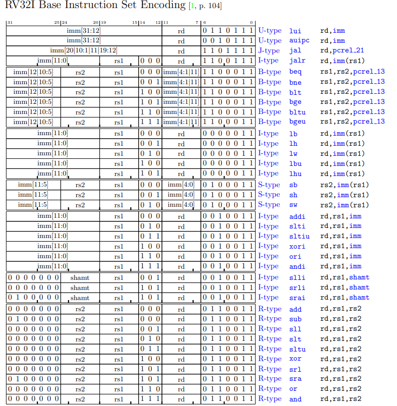

# ENGR 3410: Miniproject 4 Report  

**Design an unpipelined, multicycle, 32-bit RISC-V integer microprocessor with a von Neumann architecture**  
**Due Date:** April 14, 2025  
**Team Members:**

- Enricco Gemha
- Khor Zhi Hong
- Owen Himsworth  

## Table of Contents

- [Overview](#overview)
- [How to Use](#how-to-use)
  - [Simulation](#simulation)
  - [Synthesis](#synthesis)
  - [Testing](#testing)
- [Design Specifications](#design-specifications)
- [SystemVerilog Modules](#systemverilog-modules)
  - [top.sv](#topsv)
  - [pc.sv](#pcsv)
  - [pc_adder.sv](#pc_addersv)
  - [alu.sv](#alusv)
  - [imm_gen.sv](#imm_gensv)
  - [instruction_decoder.sv](#instruction_decodersv)
  - [instruction_register.sv](#instruction_registersv)
  - [memory.sv](#memorysv)
  - [mux_2x1.sv](#mux_2x1sv)
  - [mux_4x1.sv](#mux_4x1sv)
- [Processor Architecture](#processor-architecture)
- [Memory and Peripheral Integration](#memory-and-peripheral-integration)
- [Instruction Set Implementation](#instruction-set-implementation)
- [Testbench and Verification](#testbench-and-verification)
- [Simulation Results](#simulation-results)
- [Challenges and Design Decisions](#challenges-and-design-decisions)
- [Conclusion](#conclusion)
- [Appendix](#appendix)

## Overview

Design a 32-bit RISC-V integer microprocessor with a von Neumann architecture that executes one instruction at a time using an 8kB single memory for both code and data. The processor will integrate memory-mapped peripherals—including LED PWM controllers and timers—to run a RISC-V assembly program that blinks the LEDs.

The instructions for this project are available [here](docs/instructions.md).

## How to Build

```bash
# Build for FPGA
make build

# Run simulations
make sim

# Run cocotb tests
make cocotb

# Program FPGA
make prog
```

## Design Specifications

- **Instruction Set:** All Base RV32I instructions Type-R, I, S, B, U and J (excluding `ecall`, `ebreak`, `csrrw`, `csrrs`, `csrrc`, `csrrwi`, `csrrsi`, `csrrci`)
- **Execution Model:** Unpipelined, multicycle
- **Memory Architecture:** Single memory for instructions and data (von Neumann)
- **Memory Size:** 8kB of physical memory at the lower end of the address space
- **Peripherals:**
  - 8-bit PWM generators for user LED and RGB LEDs (iceBlinkPico)
  - Two running 32-bit timers (millisecond and microsecond counters)


## SystemVerilog Modules
Below is an **overview** of each SystemVerilog file in this project. Include details about their roles, inputs, outputs, and significant logic.


### top.sv
- **Purpose:**  
  The `top.sv` module serves as the primary integration point for the processor design. It instantiates and connects all essential submodules, including the Program Counter (PC), Instruction Register, Instruction Decoder, Immediate Generator, Memory Unit, ALU, and various multiplexers. This top-level module orchestrates the entire data path and control flow required for executing instructions.

- **Key Signals:**  
  - **Clock (`clk`) and Reset (`reset`):** Fundamental signals driving synchronous operations and system initialization.  
  - **Instruction fetch:** Carries the fetched instruction data from memory to the Instruction Register and subsequently to the Decoder.  
  - **Connection:** Facilitates the transfer of data between the ALU, Memory, and registers.  
  - **Control path:** Includes signals like `ir_write`, `alu_op`, `reg_write`, `mem_read`, `mem_write`, `branch`, and `jump` generated by the Instruction Decoder, as well as select signals for various multiplexers.


### pc.sv
- **Purpose**: The Program Counter (PC) module holds the current instruction address. It is responsible for updating the PC on each clock cycle, either resetting it or loading the next instruction address based on the control signal.
- **Inputs**:
   -  clk: Clock input that synchronizes the PC updates.
   -  rst: Reset signal; when asserted, it resets the PC to the start address (0x00000000).
   -  pc_write: Enable signal for updating the PC.
   -  next_pc: The next instruction address to be loaded into the PC.
- **Outputs**: pc: The current instruction address held by the PC.


### pc_adder.sv
- **Purpose**: The pc_adder.sv module computes the next sequential program counter value by adding a fixed offset (typically 4) to the current program counter. This operation is essential for fetching the next instruction sequentially in the program memory.
- **Inputs**: The current program counter value.
- **Outputs**: The computed address for the next instruction, which is pc plus 4.


### alu.sv
- **Purpose**: The alu.sv module performs a wide range of arithmetic and logical operations on two 32-bit input operands, a and b, based on a 4-bit control signal alu_op. It handles operations such as addition, subtraction, bitwise AND/OR/XOR, logical and arithmetic shifting, and comparisons (both signed and unsigned). Additionally, the module produces a zero_flag output, which indicates if the resulting value is zero—a feature often used for branch decisions in processor designs.
- **Inputs**: 
   -  a (32-bit): First operand for the ALU operation.
   -  b (32-bit): Second operand for the ALU operation.
   -  alu_op (4-bit): Control signal that selects which arithmetic or logical operation to perform.
- **Outputs**: 
   -  result (32-bit): The output result after performing the operation specified by alu_op.
   -  zero_flag (1-bit): A flag that is set high when result equals zero, useful for branch instructions.


### imm_gen.sv
- **Purpose**: The ImmGen module extracts and sign-extends immediate values from a 32-bit instruction based on its opcode. It supports multiple instruction formats (I-type, S-type, B-type, U-type, and J-type) by selecting and arranging specific bits from the instruction, ensuring the immediate value is correctly extended to 32 bits.
- **Inputs**: 
   -  Opcode (7-bit): Specifies the instruction type and thus the immediate format to extract.
   -  instruction (32-bit): The instruction from which the immediate value is derived.
- **Outputs**: ImmExt (32-bit): The sign-extended immediate value, adjusted based on the instruction format.


### instruction_decoder.sv
- **Purpose**: The instruction_decoder.sv module decodes a full 32-bit RISC-V instruction by extracting key fields (opcode, funct3, and funct7) and generating control signals used throughout the processor's datapath. It determines the operation to be performed by the ALU, enables writing back to registers, and controls memory access and branching.
- **Inputs**: instruction (32-bit): The complete RISC-V instruction that is to be decoded.
- **Outputs**: Control signals 
   -  alu_op (4-bit): Encoded signal that specifies the ALU operation (e.g., ADD, SUB, XOR).
   -  reg_write (1-bit): Enables writing to the register file if the instruction requires a register update.
   -  alu_src (2-bit): Selects the source of one of the ALU operands (either register value or immediate).
   -  mem_read (1-bit): Activates memory read operations when necessary.
   -  mem_write (1-bit): Activates memory write operations when required.
   -  mem_to_reg (2-bit): Determines the data routing from memory to the register file.
   -  branch (1-bit): Indicates if the current instruction is a branch instruction.
   -  jump (1-bit): Indicates if the instruction is a jump instruction.

- **R-Type**  
- **I-Type**  
- **S-Type**  
- **B-Type**  
- **U-Type**  
- **J-Type**  




### instruction_register.sv
- **Purpose**: The instruction_register.sv module captures and holds the 32-bit instruction fetched from memory. It ensures that the current instruction is available to the instruction decoder and control logic during each clock cycle.
- **Inputs**: Instruction memory output, clock, reset.
   -  clk: Clock signal that synchronizes the updates to the instruction register.
   -  reset: When asserted, resets the instruction output to zero.
   -  ir_write: Enable signal that permits updating the register with a new instruction.
   -  instruction_in: The 32-bit instruction fetched from memory.
- **Outputs**: instruction_out: The latched 32-bit instruction that is sent to the decoder and control logic


### memory.sv
- **Purpose**: The memory.sv module implements the main memory and several memory-mapped peripherals for the processor. It provides an 8kB memory space (0x00000000 to 0x00001FFF) capable of handling word, half-word, and byte accesses, with proper alignment and sign/zero extension. Additionally, this module incorporates peripherals including 8-bit PWM generators for the user LED and RGB LEDs, as well as two timers that count milliseconds and microseconds since the processor started.
   features
   -  **Main Memory:**Supports reading and writing in different data sizes (word, half-word, byte) with alignment checks. Addresses outside the defined memory range return zero.
   -  **Memory Initialization:**Can be initialized from an external file containing 2,048 lines of 32-bit hex values; defaults to zeros if no file is specified.
   -  **Memory-Mapped Peripherals:**Implements PWM outputs for four LEDs (user LED, red, green, blue) and two timers for millisecond and microsecond counts.
   -  **Data Extension:**Configures half-word and byte reads to be either sign-extended or zero-extended based on the msb of funct3.
- **Inputs**: 
   -  clk: Clock signal for synchronization.
   -  write_mem: Control signal to enable writing to memory.
   -  funct3: A 3-bit field specifying the memory access type, including the size of data and whether to sign or zero extend.
   -  write_address: 32-bit address where the data is to be written.
   -  write_data: 32-bit data input for write operations.
   -  read_address: 32-bit address from which data is to be read.
- **Outputs**: Data read from memory.
   -  read_data: 32-bit data output from memory, with appropriate extension based on the access type.
   -  led: PWM output for the user LED.
   -  red: PWM output for the red LED.
   -  green: PWM output for the green LED.
   -  blue: PWM output for the blue LED.


### mux_2x1.sv
- **Purpose**: The mux_2x1.sv module implements a parameterized 2-to-1 multiplexer. It selects between two input signals based on a 1-bit select signal, outputting one of the inputs depending on the value of the select line. The default bit-width for the inputs and output is 32 bits, but this can be adjusted via the parameter.
- **Inputs**: Data0, Data1, select signal.
   -  in0 (WIDTH bits): The first input signal.
   -  in1 (WIDTH bits): The second input signal.
   -  sel (1-bit): The select signal that determines which input is passed to the output; when sel is 0, in0 is chosen, and when sel is 1, in1 is chosen.
- **Outputs**: out (WIDTH bits): The output signal that delivers the selected input value.


### mux_4x1.sv
- **Purpose**: The mux_4x1.sv module implements a parameterized 4-to-1 multiplexer. It selects one of four input signals based on a 2-bit select signal. The module is designed to support a configurable bit-width (default 32 bits) to be used in various parts of the processor where multiple data sources need to be routed to a single destination.
- **Inputs**: Data0, Data1, Data2, Data3, select lines.
   -  in0 (WIDTH bits): First input signal.
   -  in1 (WIDTH bits): Second input signal.
   -  in2 (WIDTH bits): Third input signal.
   -  in3 (WIDTH bits): Fourth input signal.
   -  sel (2 bits): Select signal that determines which input is output; 00 selects in0, 01 selects in1, 10 selects in2, and 11 selects in3.
- **Outputs**: out (WIDTH bits): The output signal carrying the value of the selected input.


To be continued


## Processor Architecture
1. **High-Level Design**  
   - Describe how your modules connect together to form the complete processor.
   - Provide a diagram (if possible) illustrating the data and control paths.

2. **Control Unit**  
   - Explain how you generate control signals to step through instruction execution in multiple cycles.

3. **Datapath**  
   - Show how the PC, instruction register, ALU, immediate generator, and multiplexers interact in each cycle.

---

## Memory and Peripheral Integration
Explain how the **memory.sv** module is connected to the processor and how you interface with peripherals:
- Memory map regions (e.g., 0x0000 to 0x1FFF for 8kB memory, higher addresses for peripherals).
- Interaction with LED PWM controllers and timers (if you have separate modules or are stubbing them out).

---

## Instruction Set Implementation

This processor implements the RV32I base instruction set (with exceptions noted in the project requirements). The implementation supports all standard instruction types (R, I, S, B, U, J) through the `instruction_decoder.sv` and `imm_gen.sv` modules.

### Instruction Decoding

The `instruction_decoder.sv` extracts instruction fields (opcode, funct3, funct7) and generates appropriate control signals:

- **alu_op**: Determines ALU operation based on instruction type and function codes
- **reg_write**: Enables register file writes for instructions that modify registers
- **alu_src**: Selects ALU input sources (register data or immediate values)
- **mem_read/mem_write**: Controls memory access operations
- **mem_to_reg**: Selects data to write back to registers
- **branch/jump**: Controls program flow changes

### Immediate Generation

The `imm_gen.sv` module handles different immediate formats:

- **I-type**: Sign-extends 12-bit immediate for loads, ALU operations, and JALR
- **S-type**: Reconstructs immediate from instruction bits [31:25] and [11:7]
- **B-type**: Forms 13-bit immediate with LSB=0 for aligned addresses
- **U-type**: Places 20-bit immediate in upper bits [31:12]
- **J-type**: Constructs 21-bit immediate for jump targets

### Special Handling

- **Shift Instructions**: For shift operations, only the lower 5 bits of the second operand are used
- **Branch Instructions**: Comparison operations set the zero flag for conditional branching
- **Jump Instructions**: Return addresses are stored in the destination register (rd)

### Instruction Set

| Type | Instruction | Syntax | Description |
|------|------------|--------|-------------|
| U-type | `lui` | `lui rd, imm` | Load Upper Immediate |
| U-type | `auipc` | `auipc rd, imm` | Add Upper Immediate to PC |
| J-type | `jal` | `jal rd, pcrel_21` | Jump and Link |
| I-type | `jalr` | `jalr rd, imm(rs1)` | Jump and Link Register |
| B-type | `beq` | `beq rs1, rs2, pcrel_13` | Branch if Equal |
| B-type | `bne` | `bne rs1, rs2, pcrel_13` | Branch if Not Equal |
| B-type | `blt` | `blt rs1, rs2, pcrel_13` | Branch if Less Than |
| B-type | `bge` | `bge rs1, rs2, pcrel_13` | Branch if Greater Than or Equal |
| B-type | `bltu` | `bltu rs1, rs2, pcrel_13` | Branch if Less Than (Unsigned) |
| B-type | `bgeu` | `bgeu rs1, rs2, pcrel_13` | Branch if Greater Than or Equal (Unsigned) |
| I-type | `lb` | `lb rd, imm(rs1)` | Load Byte |
| I-type | `lh` | `lh rd, imm(rs1)` | Load Halfword |
| I-type | `lw` | `lw rd, imm(rs1)` | Load Word |
| I-type | `lbu` | `lbu rd, imm(rs1)` | Load Byte (Unsigned) |
| I-type | `lhu` | `lhu rd, imm(rs1)` | Load Halfword (Unsigned) |
| S-type | `sb` | `sb rs2, imm(rs1)` | Store Byte |
| S-type | `sh` | `sh rs2, imm(rs1)` | Store Halfword |
| S-type | `sw` | `sw rs2, imm(rs1)` | Store Word |
| I-type | `addi` | `addi rd, rs1, imm` | Add Immediate |
| I-type | `slti` | `slti rd, rs1, imm` | Set Less Than Immediate |
| I-type | `sltiu` | `sltiu rd, rs1, imm` | Set Less Than Immediate (Unsigned) |
| I-type | `xori` | `xori rd, rs1, imm` | XOR Immediate |
| I-type | `ori` | `ori rd, rs1, imm` | OR Immediate |
| I-type | `andi` | `andi rd, rs1, imm` | AND Immediate |
| I-type | `slli` | `slli rd, rs1, shamt` | Shift Left Logical Immediate |
| I-type | `srli` | `srli rd, rs1, shamt` | Shift Right Logical Immediate |
| I-type | `srai` | `srai rd, rs1, shamt` | Shift Right Arithmetic Immediate |
| R-type | `add` | `add rd, rs1, rs2` | Add |
| R-type | `sub` | `sub rd, rs1, rs2` | Subtract |
| R-type | `sll` | `sll rd, rs1, rs2` | Shift Left Logical |
| R-type | `slt` | `slt rd, rs1, rs2` | Set Less Than |
| R-type | `sltu` | `sltu rd, rs1, rs2` | Set Less Than (Unsigned) |
| R-type | `xor` | `xor rd, rs1, rs2` | XOR |
| R-type | `srl` | `srl rd, rs1, rs2` | Shift Right Logical |
| R-type | `sra` | `sra rd, rs1, rs2` | Shift Right Arithmetic |
| R-type | `or` | `or rd, rs1, rs2` | OR |
| R-type | `and` | `and rd, rs1, rs2` | AND |

**Note:** As per project requirements, the following instructions are excluded from implementation:

- `ecall`, `ebreak` (environment calls)
- `csrrw`, `csrrs`, `csrrc`, `csrrwi`, `csrrsi`, `csrrci` (control and status register instructions)
- Atomic read/write instructions

---

## Testbench and Verification
1. **Testbench Setup**  
   - Describe the testbench environment (files, top test module, how you instantiate `top.sv`).
   - Mention any memory initialization methods (e.g., `$readmemh` or $readmemb).

2. **Verification Approach**  
   - List the types of tests you performed (random, directed, or standard RISC-V tests).
   - If you have waveforms or logs, reference them here.

---

## Simulation Results
Include screenshots or references to your waveforms (VCD, FST, etc.) from Icarus Verilog or another simulator. For example:

